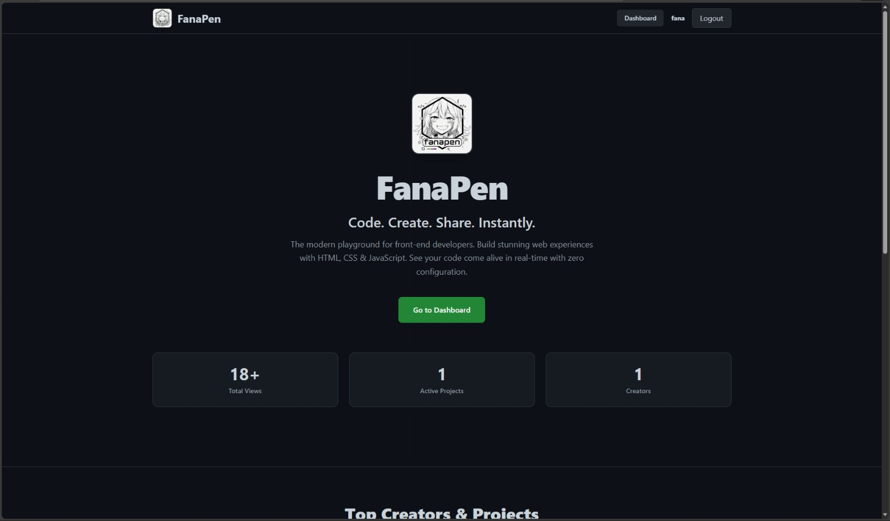
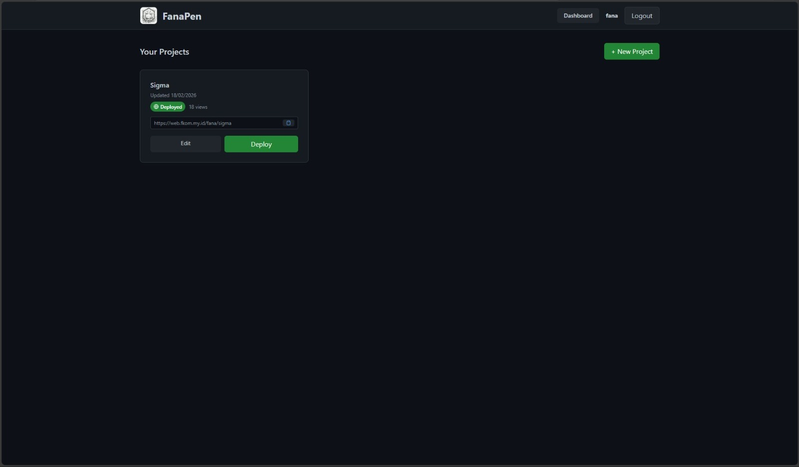
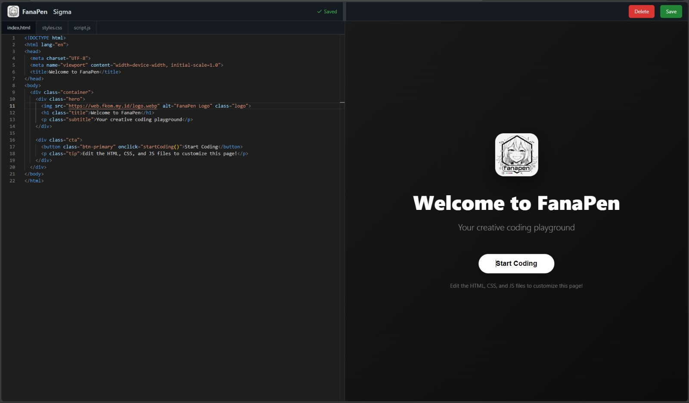
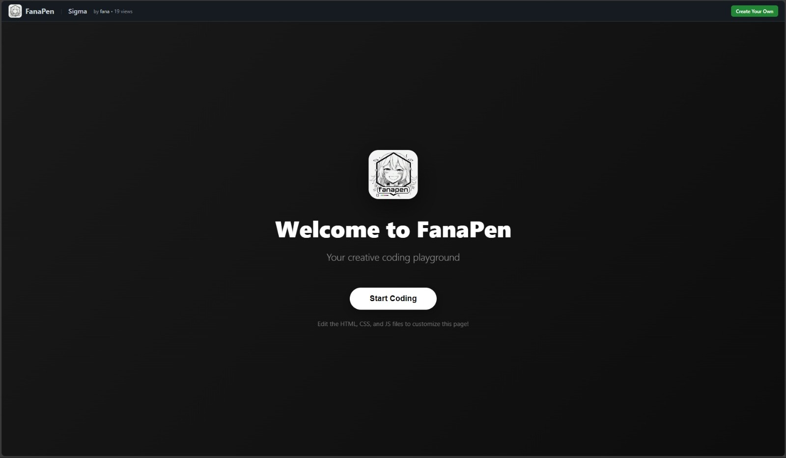

# FanaPen

<div align="center">


</div>

FanaPen is a modern, open-source CodePen-style playground built with SvelteKit 5. Write HTML, CSS, and JS side by side in Monaco, see a live preview instantly, and share your projects with the world.

## Screenshots

| Home | Dashboard |
| --- | --- |
|  |  |
| Editor | Preview |
|  |  |

## Features

- Live preview for HTML, CSS, and JS with a safe sandboxed iframe
- Monaco editor with language-aware editing for web languages
- Project dashboard with create, edit, deploy, and share flows
- Autosave with visual save state indicators
- Public sharing via slug-based URLs
- Leaderboards for top projects and creators
- Sessions-based authentication (username + password)
- Cloudflare Workers deployment ready
- SurrealDB-backed persistence

## Tech Stack

- SvelteKit 5 + Svelte 5
- Vite + TypeScript
- Tailwind CSS 4
- Monaco Editor
- SurrealDB
- Cloudflare Workers + Wrangler

## Getting Started

### Prerequisites

- Node.js 18+ recommended
- pnpm
- SurrealDB (local or remote)

### Install

```bash
pnpm install
```

### Configure Environment

Create a `.env` file in the project root with your SurrealDB credentials:

```bash
SURREAL_URL=http://127.0.0.1:8000
SURREAL_NAMESPACE=FanaPen
SURREAL_DATABASE=one
SURREAL_USERNAME=your_username
SURREAL_PASSWORD=your_password
```

For Cloudflare Workers, set these as Wrangler vars or secrets.

### Apply Database Schema

The SurrealDB schema is in `schema.surql`. Apply it using the SurrealDB CLI:

```bash
surreal sql \
	--endpoint http://127.0.0.1:8000 \
	--namespace FanaPen \
	--database one \
	--username your_username \
	--password your_password \
	< schema.surql
```

### Run Locally

```bash
pnpm dev
```

### Run with Cloudflare Workers

```bash
pnpm wdev
```

### Preview Production Build

```bash
pnpm preview
```

## Scripts

- `pnpm dev` - local dev server
- `pnpm wdev` - Wrangler dev for Workers
- `pnpm build` - production build
- `pnpm preview` - build and run with Wrangler
- `pnpm deploy` - deploy to Cloudflare Workers
- `pnpm lint` - lint and format checks
- `pnpm format` - format codebase

## Project Structure

- [src/routes](src/routes) - pages, server actions, and UI routes
- [src/lib/components](src/lib/components) - reusable UI components
- [src/lib/db](src/lib/db) - database access layer
- [src/lib/auth](src/lib/auth) - session and auth helpers

## Deployment

This project is configured for Cloudflare Workers via Wrangler. Update [wrangler.jsonc](wrangler.jsonc) and run:

```bash
pnpm deploy
```

## Security Notes

- Set production secrets using `wrangler secret put` for SurrealDB credentials.
- Session cookies are HTTP-only and set to `secure` in production.

## Contributing

Contributions are welcome. Please open an issue or a pull request with a clear description.

1. Fork the repo
2. Create a feature branch
3. Commit your changes
4. Open a PR

## License

MIT
